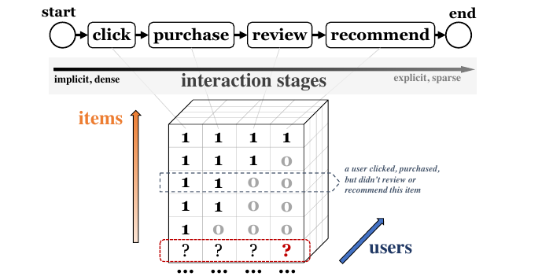
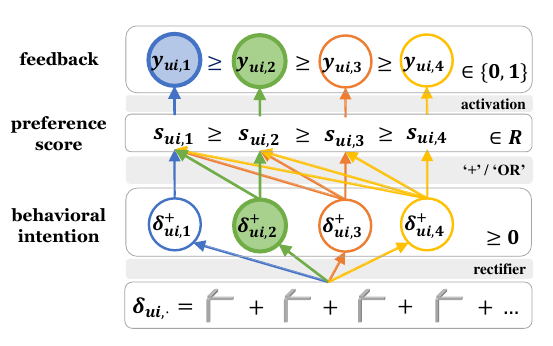

# chainRec

This repo includes a tensorflow implementation of the algorithm -- chainRec, proposed in the paper

**Mengting Wan, Julian McAuley, "Item Recommendation on Monotonic Behavior Chains", in Proc. of 2018 ACM Conference on Recommender Systems (RecSys'18), Vancouver, Canada, Oct. 2018.**

We also contributed a new large-scale book review dataset -- Goodreads. Details of the dataset can be found [here](https://sites.google.com/eng.ucsd.edu/ucsdbookgraph/home).

If you would like to use our dataset, extend our algorithm, or use our source code, please consider citing our paper (listed above). Thanks!

Any questions please contact Mengting Wan (mengting.wan at gmail.com).

## What is chainRec?
We unify a spectrum of implicit and explicit user feedback on a *monotonic behavior* whereany signal necessarily implies the presence of a weaker (or more implicit) signal. 

 - For example, dierent user-item interactions in e-commerce systems can be encoded as binary states on a chain, which semantically represents if a user clicks, purchases, reviews or recommends, (e.g. a rating score larger than some threshold) the item. A ‘review’ action implies a ‘purchase’ action, which implies a ‘click’ action, etc.
 

  

Given historical observations of users’ behavior chains, we seek to estimate their responses toward unobserved items. Specifically, we propose an algorithm -- *chainRec* where

 - we design a scoring function to make use of all types of responses, and preserve the monotonic constraints in the resulting user preference scores;
 - we also develop a new optimization criterion which takes advantage of the monotonicity and automatically focuses on the most critical information in users’ feedback data.

<table align="center"><tr>
<td>  </td>
<td>  </td>
</tr></table>

More details please consult in our [paper](https://github.com/MengtingWan/mengtingwan.github.io/raw/master/paper/recsys18_mwan.pdf).

## Quick Start

Requirement:

 - Python 3.6+ (older version has not been tested)
 - Tensorflow 1.6.0+ (older version has not been tested)

Quick start with a small dataset [YooChoose](http://2015.recsyschallenge.com/), where we regard the recommendation performance on the most explicit (i.e., the last) stage as our primary evaluation criterion.

`python test_final_stage.py --dataset yoochoose --method chainRec_uniform --nStage 2 --embedSize 16 --l2 0.1`

Results will be saved under a folder `./results/`.

## To-Do
Add more datasets, more baselines and more parameter options.
